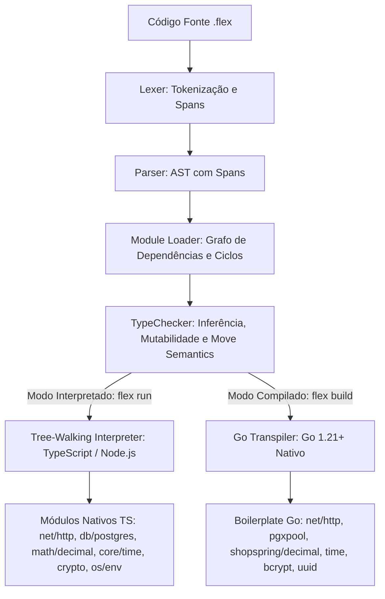

# Visão Geral de Arquitetura — FlexLang v0.3.0

> **Status:** Draft · **Dono:** Arquitetura de Software e Compiladores · **Última revisão:** agosto/2026
> **Relacionado:** [PRD](prd.md), [Test Plan](test_plan.md), [Release Plan](release_plan.md)

---

## 1. Topologia do Compilador e Runtimes

A arquitetura do compilador FlexLang é organizada em um pipeline multiestágio que atende a dois modos de execução com paridade semântica estrita:



---

## 2. Inovações Estruturais da v0.3.0

### 2.1 Sistema de Tipos Estendido (`checker.ts`)

A representação interna `FlexType` é enriquecida com os novos tipos da versão:

```typescript
export type FlexType =
  | { kind: "Int" }
  | { kind: "Float" }
  | { kind: "String" }
  | { kind: "Bool" }
  | { kind: "Array"; elementType: FlexType }
  | { kind: "HashMap"; keyType: FlexType; valueType: FlexType } // NOVO na v0.3
  | { kind: "Struct"; name: string; genericArgs: FlexType[] }
  | { kind: "Enum"; name: string; genericArgs: FlexType[] }
  | { kind: "Map" }
  | { kind: "Void" }
  | { kind: "Any" };
```

Tipos adicionais fornecidos pelos módulos nativos (como `Decimal`, `Time`, `Duration`) são registrados como `NativeType` com checagem rigorosa de métodos estáticos e de instância via tabela de assinaturas (`NativeSignature`).

---

### 2.2 Unificação de Métodos Primitivos (`String` e `Array`)

Para manter o compilador modular, métodos de tipos primitivos (`str.len()`, `arr.map()`) são resolvidos pelo `TypeChecker` no ponto de avaliação de `MemberExpr`/`CallExpr`:

1. **Checagem Estática**: O `TypeChecker` inspeciona o `callerType`. Se for `String` ou `Array`, consulta a tabela de builtins primitivos e valida parâmetros, tipos de retorno e exigência de `mut`.
2. **Interpretador**: Executa chamadas correspondentes no runtime JavaScript com zero overhead de wrapping desnecessário.
3. **Go Transpiler**: Emite expressões Go idiomáticas (`len([]rune(s))`, `strings.Split`, `append`, funções auxiliares com generics Go).

---

### 2.3 Módulo `math/decimal` e Paridade de Ponto Fixo

O módulo `math/decimal` é implementado em duas camadas espelhadas:

- **No Interpretador**: Implementação interna baseada em ponto fixo (`BigInt` + escala de casas decimais), garantindo que operações como `add`, `sub`, `mul`, `div` e `round` operem sem perda de precisão e com algoritmo de arredondamento bancário (*Banker's Rounding / Half-Even*).
- **No Compilador Go**: O transpiler injeta e vincula diretamente ao pacote `github.com/shopspring/decimal`, mapeando métodos para `decimal.Decimal.Add()`, `Sub()`, `Mul()`, `Div()` e `RoundBank()`.

---

### 2.4 Resolução de Closures e Escopo Léxico (`LambdaExpr`)

```mermaid
sequenceDiagram
    participant UserCode as Código do Usuário
    participant Parser as Parser
    participant Checker as TypeChecker
    participant Interp as Interpretador TS
    participant GoGen as Go Transpiler

    UserCode->>Parser: let f = |x| { return x + offset; }
    Parser->>Checker: LambdaExpr com parâmetros e corpo
    Checker->>Checker: Valida tipos, captura `offset` do TypeEnvironment pai
    Checker->>Interp: FlexFunction com referência ao Environment atual
    Checker->>GoGen: func(x int) int { return x + offset } (Go closure)
```

No Go gerado, closures são emitidas como funções anônimas nativas de primeira classe, preservando referências a variáveis do escopo pai sem necessidade de estruturas intermediárias complexas.

---

## 3. Guia de Módulos da Stdlib v0.3.0

| Módulo | Caminho do Import | Papel no Backend Bancário |
|---|---|---|
| `net/http` | `import { Server, Request, Response, Middleware } from "net/http"` | Servidor HTTP de alta performance com roteamento por verbo e middlewares |
| `db/postgres` | `import { Pool, Tx } from "db/postgres"` | Conexão com Postgres, transações ACID e queries parametrizadas `$1` |
| `math/decimal` | `import { Decimal } from "math/decimal"` | Aritmética monetária de precisão arbitrária e juros compostos |
| `os/env` | `import { env } from "os/env"` | Leitura de variáveis de ambiente (`DATABASE_URL`, segredos) |
| `core/time` | `import { Time, Duration } from "core/time"` | Timestamps UTC, prazos de expiração de token e medição de latência |
| `crypto` | `import { hash, uuid, hmac, sha256 } from "crypto"` | Hashing bcrypt de senhas, geração de UUID v4 e validação de HMAC |
| `core/log` | `import { log } from "core/log"` | Logging estruturado com mascaramento automático de dados confidenciais |
