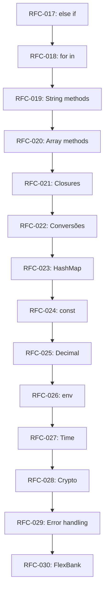

# PRD — FlexLang v0.3.0

> **Status:** Draft · **Dono:** Arquitetura FlexLang · **Última revisão:** agosto/2026
> **Versão anterior:** [`.docs/v0.2/`](../v0.2/) — APIs REST, Middlewares, CORS, Float, Diagnósticos, Watch Mode.

---

## 1. Contexto e Motivação

A v0.2.0 provou que a FlexLang consegue expressar APIs REST completas com middlewares, CORS, roteamento por verbo, aritmética de ponto flutuante e diagnósticos ricos. O projeto de referência `Le Salvi API` demonstrou todos esses recursos de ponta a ponta.

Mas há uma distância enorme entre "conseguir expressar uma API REST" e "conseguir construir um sistema backend enterprise de verdade". Para validar essa tese, escolhemos o **caso de uso mais exigente possível: o backend de um banco digital**.

### 1.1 Por que um backend de banco?

Um backend financeiro exige, simultaneamente:

- **Precisão monetária absoluta**: `0.1 + 0.2 != 0.3` em IEEE 754. Valores em reais/centavos, taxas de câmbio, juros compostos e split de pagamentos precisam de aritmética decimal de precisão arbitrária.
- **Controle de erro granular**: Transferências parcialmente falhas, timeouts em integrações externas, idempotência, retry com backoff — não basta `Result<T, E>`, é preciso domínio sobre o ciclo de vida do erro.
- **Isolamento de dados por request**: Tenant-ID, correlation-ID, contexto de auditoria — cada request carrega metadados que precisam fluir implicitamente por toda a cadeia sem poluir assinaturas de função.
- **Resiliência e observabilidade**: Circuit breakers, métricas, tracing distribuído, health checks graduais (liveness vs readiness).
- **Segurança em profundidade**: Hashing de senhas, validação de schemas de entrada, rate limiting, sanitização de output.
- **Operações de banco de dados complexas**: Transações aninhadas (savepoints), migrações de schema, queries complexas com JOINs, paginação cursor-based.

### 1.2 O que a análise do código-fonte revelou

Executando e inspecionando cada arquivo do compilador (`src/*.ts`, `src/modules/*.ts`), estas são as lacunas concretas:

| # | Lacuna | Impacto | Evidência |
|---|---|---|---|
| L1 | **Não existe tipo `Decimal`** | Qualquer cálculo monetário (`saldo + juros`) produz arredondamento silencioso. IEEE 754 Float é inaceitável para finanças. | `checker.ts:29-39` — FlexType não tem `Decimal`. |
| L2 | **Sem `else if`** | Todo despacho condicional encadeado vira pirâmide aninhada ilegível. | `parser.ts:430-432` — `else` espera `{` diretamente, não aceita `if`. |
| L3 | **Sem `HashMap` / `Map` tipado** | Impossível representar caches, lookups, contadores, registros dinâmicos. O `MapLiteral` atual só serve para JSON anônimo. | `ast.ts:406-410` — `MapLiteral` não tem tipagem de chave/valor. |
| L4 | **Sem manipulação de `String`** | Não há `len`, `contains`, `split`, `trim`, `to_upper`, `to_lower`, `starts_with`, `replace`, `substring`. Impossível validar CPF, email, formatar moeda. | Nenhum método de String no checker ou interpretador. |
| L5 | **Sem manipulação de `Array`** | Não há `len`, `push`, `pop`, `map`, `filter`, `find`, `contains`, `sort`, `slice`, `concat`, `is_empty`. Impossível trabalhar com listas de transações. | Nenhum método de Array no checker ou interpretador. |
| L6 | **Sem closures capturando variáveis** | Lambdas existem (`LambdaExpr`) mas não capturam variáveis do escopo envolvente. Inviabiliza padrões funcionais (map/filter com predicado). | `interpreter.ts` — lambda não forma closure sobre o escopo pai. |
| L7 | **Sem `try/catch` ou tratamento de erros em bloco** | O `?` propaga, mas não há como interceptar e tratar um erro localmente com lógica customizada (ex: retry, fallback). | Nenhum `catch`/`recover` na AST. |
| L8 | **Sem variáveis de ambiente** | Credenciais, feature flags e configuração por ambiente são hardcoded. | Nenhum módulo `env` ou `os` no registry. |
| L9 | **Sem módulo de tempo** | Não há como medir duração, criar timestamps, calcular prazos, definir TTL. | Nenhum módulo `time` no registry. |
| L10 | **Sem módulo de hashing/crypto** | Impossível hashear senhas (bcrypt), gerar UUIDs, criar HMACs para webhooks. | Nenhum módulo `crypto` no registry. |
| L11 | **Sem validação de entrada** | Não há como validar schemas de request (campos obrigatórios, tipos, ranges, formatos). | Nenhum framework de validação. |
| L12 | **`for` limitado a ranges numéricos** | `for i in 0..10` existe, mas `for item in lista` não. Impossível iterar sobre arrays e maps. | `parser.ts:ForStmt` — só aceita `start..end`. |
| L13 | **Sem conversões `Int ↔ String`** | Não há `to_string()` para Int/Float nem `parse_int()`/`parse_float()` para String. | Nenhuma função de conversão no checker. |
| L14 | **Sem `const` de nível de módulo** | Não há como definir constantes globais (`TAX_RATE`, `MAX_RETRIES`). `let` no top-level é sempre mutável no Go gerado. | `transpiler.ts` — `let` vira `var` no Go, não `const`. |
| L15 | **Sem tipos `Optional Fields` em structs** | Campos de struct são todos obrigatórios. Impossível representar DTOs com campos opcionais (ex: `middle_name: Option<String>`). | `checker.ts:StructDeclaration` — sem conceito de campo opcional. |

---

## 2. Objetivo da v0.3.0

> Tornar a FlexLang capaz de implementar um **backend financeiro de nível enterprise** — completo com aritmética decimal precisa, manipulação rica de strings e arrays, closures, iteração sobre coleções, variáveis de ambiente, timestamping, hashing de senhas, e controle de fluxo expressivo — mantendo 100% de paridade entre interpretador e binário Go compilado.

### 2.1 Caso de Uso de Referência: "FlexBank API"

O projeto de validação será um backend de banco digital implementado inteiramente em FlexLang, com:

- Cadastro de contas com validação de CPF e hashing de senha
- Saldo em `Decimal` com precisão de centavo
- Transferências entre contas com transações ACID e idempotência
- Extrato com paginação cursor-based
- Cálculo de juros compostos com `Decimal`
- Autenticação por token com expiração e variáveis de ambiente
- Logs de auditoria com timestamps e correlation IDs
- Health checks (liveness + readiness)

---

## 3. Escopo: O que ENTRA na v0.3.0

### 3.1 Linguagem Core (Breaking Changes permitidos em 0.x)

| RFC | Título | Prioridade |
|---|---|---|
| [017](rfcs/rfc-017-else-if-and-control-flow.md) | `else if`, `break`, `continue` e expressões ternárias | **P0** |
| [018](rfcs/rfc-018-for-in-collections.md) | `for item in collection` (Arrays, Maps, Ranges) | **P0** |
| [019](rfcs/rfc-019-string-methods.md) | Métodos de `String` (`len`, `contains`, `split`, `trim`, `to_upper`, `to_lower`, `starts_with`, `ends_with`, `replace`, `substring`, `index_of`) | **P0** |
| [020](rfcs/rfc-020-array-methods.md) | Métodos de `Array` (`len`, `push`, `pop`, `map`, `filter`, `find`, `contains`, `sort`, `slice`, `concat`, `is_empty`, `for_each`) | **P0** |
| [021](rfcs/rfc-021-closures.md) | Closures com captura de escopo e funções de alta ordem | **P0** |
| [022](rfcs/rfc-022-type-conversions.md) | Conversões de tipo (`to_string`, `parse_int`, `parse_float`, `to_decimal`) | **P0** |
| [023](rfcs/rfc-023-hashmap.md) | `HashMap<K, V>` tipado com API completa | P1 |
| [024](rfcs/rfc-024-const-declarations.md) | Declarações `const` de nível de módulo | P1 |

### 3.2 Módulos Nativos da Stdlib

| RFC | Título | Prioridade |
|---|---|---|
| [025](rfcs/rfc-025-decimal-module.md) | Módulo `math/decimal` — Aritmética monetária de precisão arbitrária | **P0** |
| [026](rfcs/rfc-026-env-module.md) | Módulo `os/env` — Variáveis de ambiente | **P0** |
| [027](rfcs/rfc-027-time-module.md) | Módulo `core/time` — Timestamps, duração, formatação de datas | **P0** |
| [028](rfcs/rfc-028-crypto-module.md) | Módulo `crypto` — Hashing (bcrypt, SHA-256), UUID, HMAC | P1 |

### 3.3 Infraestrutura e DX

| RFC | Título | Prioridade |
|---|---|---|
| [029](rfcs/rfc-029-enhanced-error-handling.md) | `catch` blocks e padrões avançados de tratamento de erros | P1 |
| [030](rfcs/rfc-030-project-validation.md) | Projeto de referência FlexBank API e test suite enterprise | P1 |

---

## 4. Escopo: O que FICA DE FORA da v0.3.0 (Deliberadamente)

| Item | Razão |
|---|---|
| Generics de usuário (`struct Stack<T>`) | Complexidade alta no transpiler Go. Reservado para 0.4+. |
| Async/Await | A FlexLang já resolve isso com `scope`/`spawn`/`Channel`. |
| Package Manager de terceiros | Prematuro. O sistema de módulos nativos + locais é suficiente. |
| WebSocket e gRPC | Fora do caso de uso de referência. |
| ORM / Query Builder | A API de `db/postgres` parametrizada é deliberadamente low-level. |
| Interface gráfica / CLI REPL | Não é foco de linguagem de backend. |
| Rate limiting como módulo nativo | Pode ser implementado em userland com `HashMap` e `Time`. |

---

## 5. Ordem de Execução Recomendada

**Fase 1 — Linguagem Core** (RFCs 017-024): Expande o poder expressivo da linguagem. Todas as demais funcionalidades dependem disso.

**Fase 2 — Módulos Nativos** (RFCs 025-028): Cada módulo depende das primitivas da Fase 1 (String methods para formatação, Array methods para operações em batch, etc).

**Fase 3 — Integração e Validação** (RFCs 029-030): Tratamento de erros avançado e o projeto de referência que valida tudo de ponta a ponta.

---

## 6. Critérios de Aceite da Release

1. **Paridade 100%**: Todo teste passa identicamente em `flex run` e `flex build` + binário.
2. **Parity Gate**: O `npm run test:parity` deve cobrir todas as features novas.
3. **Projeto FlexBank API**: O backend completo compila, roda, e passa num smoke test de integração com requests reais.
4. **Zero Regressão**: Todos os 35 golden tests, 96 HTTP tests, 8 watch tests e 26 diagnostic tests da v0.2.0 continuam passando.
5. **Documentação**: README, CHANGELOG e exemplos atualizados.
