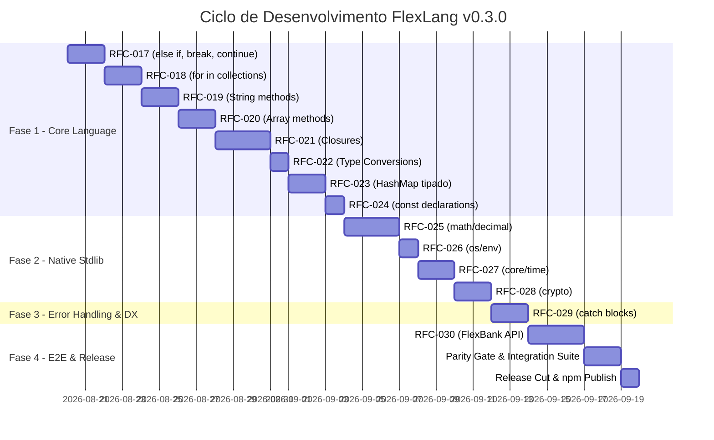

# Plano de Release — FlexLang v0.3.0

> **Status:** Draft · **Dono:** Gerência de Engenharia e Release Management · **Última revisão:** agosto/2026
> **Relacionado:** [PRD](prd.md), [Test Plan](test_plan.md), RFCs 017 a 030 em [`rfcs/`](rfcs/)

---

## 1. Estratégia de Versionamento

A FlexLang segue o modelo **SemVer adaptado para a trilha 0.x**:

- **Versão Alvo**: `0.3.0`
- **Pacote npm**: `@flexlang/cli`
- **Tag Git**: `v0.3.0`
- **Regras do Ciclo `0.x`**:
  - `MINOR` (`0.2` → `0.3`): Adiciona novos recursos expressivos de linguagem (`else if`, `for..in`, `String`/`Array` methods, `closures`, `HashMap`, `const`, `Decimal`, `env`, `Time`, `crypto`, `catch`). Preserva compatibilidade com código da v0.2.0 (aditivo e retrocompatível).
  - `PATCH` (`0.3.1`, `0.3.2`): Correções de bugs sem novas palavras-chave ou alterações de AST.

---

## 2. Fases de Implementação e Milestones

O ciclo de desenvolvimento da v0.3.0 é dividido em **4 Milestones sequenciais**:

---

### 2.1 Detalhamento das Fases

#### Milestone 1: Linguagem Core e Expressividade (RFCs 017-024)
- **Entregáveis**:
  - `else if`, `break` e `continue` no lexer, parser, checker, interpretador e transpiler Go.
  - `for in` genérico sobre arrays, maps e ranges com desestruturação de índice opcional.
  - Tabela de métodos estáticos e de instância para `String` e `Array`.
  - Captura de escopo léxico em closures (`LambdaExpr`) com preservação de mutabilidade e move semantics.
  - Funções de conversão `to_string()`, `parse_int()`, `parse_float()`.
  - Tipo `HashMap<K, V>` com hash lookup no interpretador e `map[K]V` no Go.
  - Declaração `const` top-level com validação de imutabilidade absoluta.
- **Critério de Saída (Exit Gate)**:
  - 100% dos novos golden tests (`37` a `46`) passando no interpretador e compilador.

#### Milestone 2: Módulos Nativos de Nível Enterprise (RFCs 025-028)
- **Entregáveis**:
  - `src/modules/decimal.ts`: Aritmética de precisão arbitrária (`math/decimal`) com runtime TS e binding Go com `shopspring/decimal`.
  - `src/modules/env.ts`: Módulo `os/env` para injeção e leitura segura de variáveis de ambiente.
  - `src/modules/time.ts`: Módulo `core/time` para timestamps UTC, durações e prazos.
  - `src/modules/crypto.ts`: Módulo `crypto` para bcrypt, UUID v4, HMAC-SHA256 e SHA-256.
- **Critério de Saída (Exit Gate)**:
  - Bateria de testes de precisão decimal passando com zero desvio (`tests/decimal_precision.ts`).
  - Golden tests `47` a `51` verdes no parity gate.

#### Milestone 3: Tratamento de Erros e DX Avançada (RFC-029)
- **Entregáveis**:
  - Parser e interpretador de expressões `catch`.
  - Emissão de controle de fluxo seguro em Go para recuperação de `Result.Err`.
  - Golden test `52` validando fallbacks e retries.
- **Critério de Saída (Exit Gate)**:
  - Redução de boilerplate em fluxos de erro comparado a `match` manual.

#### Milestone 4: Validação E2E, Documentação e Publicação (RFC-030)
- **Entregáveis**:
  - Criação do projeto `examples/09_flexbank_api` cobrindo 100% das features da v0.3.0.
  - Runner de integração bancária `tests/flexbank_integration.ts`.
  - Atualização completa de `README.md`, `CHANGELOG.md` e extensões de editor.
  - Publicação da release `@flexlang/cli@0.3.0` no npm com tag git `v0.3.0`.

---

## 3. Matriz de Riscos Técnicos e Planos de Mitigação

| # | Risco Técnico | Probabilidade | Impacto | Estratégia de Mitigação |
|---|---|---|---|---|
| **R1** | **Dependência externa Go para Decimal** (`shopspring/decimal`) | Média | Alto | O compilador Go injeta automaticamente a definição do `go.mod` ao transpolar projetos que usam `math/decimal`, ou embute o pacote no build pipeline. |
| **R2** | **Complexidade de Closures no Go Transpiler** | Média | Alto | Mapear lambdas diretamente para closures nativas Go (`func(...)`), aproveitando que a semântica de escopo e ponteiros do Go já resolve a captura. |
| **R3** | **Divergência de Arredondamento entre TS e Go** | Baixa | Crítico | Implementar algoritmo Banker's Rounding (Half-Even) estrito no TS idêntico à especificação do `shopspring/decimal.RoundBank()`. |
| **R4** | **Incompatibilidade de Tipos em `for in` aninhado** | Baixa | Médio | TypeChecker resolve tipo do iterador antes de analisar o corpo do bloco, inserindo variável no `TypeEnvironment` local com span correto. |
| **R5** | **Regressão nos 35 golden tests existentes** | Baixa | Alto | Executar suite legada a cada commit via CI automatizado (`npm test`, `npm run test:parity`). |

---

## 4. Definition of Done (DoD) para a Release v0.3.0

Para a release ser cortada e publicada, TODOS os critérios abaixo devem ser cumpridos:

- [ ] Todas as 14 RFCs (017 a 030) com status alterado para `Implementado`.
- [ ] 100% dos testes unitários legados e novos passando (`npm test`).
- [ ] 100% de paridade no Parity Gate (`npm run test:parity`).
- [ ] Bateria de testes de precisão decimal sem falhas (`npm run test:decimal`).
- [ ] Testes de integração HTTP, Postgres e Watch passando (`npm run test:http`, `npm run test:db`, `npm run test:watch`).
- [ ] Exemplo `examples/09_flexbank_api` executando perfeitamente em modo `run`, `run --watch` e `build`.
- [ ] `CHANGELOG.md` documentando todas as adições e melhorias da v0.3.0.
- [ ] Versão atualizada em `package.json` para `0.3.0`.
- [ ] Tag git `v0.3.0` criada e assinada.
- [ ] Pacote publicado no registro público do npm sob a tag `latest`.
