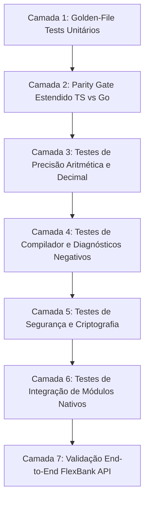

# Plano de Testes — FlexLang v0.3.0 (Enterprise Readiness)

> **Status:** Draft · **Dono:** Qualidade e Engenharia de Compiladores · **Última revisão:** agosto/2026
> **Relacionado:** [PRD](prd.md), [Release Plan](release_plan.md), RFCs 017 a 030 em [`rfcs/`](rfcs/)

---

## 1. Visão Geral e Filosofia de Testes

A versão **v0.3.0** eleva a FlexLang para o padrão de exigência de sistemas críticos (backend bancário). Em sistemas financeiros, erros sutis de arredondamento, vazamento de mutabilidade entre threads, inconsistências entre interpretador e binário compilado ou falhas de controle de fluxo podem causar desastres contábeis.

Por isso, o plano de testes da v0.3.0 expande a pirâmide de testes para **7 camadas rigorosas de validação contínua**.

---

## 2. As 7 Camadas de Teste



---

### 2.1 Camada 1: Golden-File Tests (`tests/*.flex` + `tests/*.out`)

Testa o comportamento determinístico da linguagem através do runner padrão (`npm test`).

#### Novos Testes Planejados:
| Arquivo | Feature Coberta | Descrição |
|---|---|---|
| `37_else_if_control_flow.flex` | RFC-017 | `else if` com 4 branches, `break` e `continue` em `for` e `while` |
| `38_for_in_collections.flex` | RFC-018 | Iteração sobre `[Int]`, `[String]`, com índice `for item, idx in arr` |
| `39_string_methods.flex` | RFC-019 | Teste de todos os 11 métodos de String (`len`, `split`, `trim`, `replace`, etc.) |
| `40_array_methods_immut.flex` | RFC-020 | Métodos imutáveis (`len`, `is_empty`, `contains`, `slice`, `concat`) |
| `41_array_methods_mut.flex` | RFC-020 | Métodos mutáveis (`push`, `pop`, `sort`) em variáveis `let mut` |
| `42_closures_scope.flex` | RFC-021 | Closures capturando variáveis locais e `mut` do escopo envolvente |
| `43_array_hof.flex` | RFC-020/021 | `map`, `filter`, `find`, `for_each` combinados com closures |
| `44_type_conversions.flex` | RFC-022 | `to_string()` para Int/Float/Bool e `parse_int`/`parse_float` com Result |
| `45_hashmap_typed.flex` | RFC-023 | `HashMap.new()`, `set`, `get`, `remove`, `keys`, `values`, iteração `for k, v in map` |
| `46_const_declarations.flex` | RFC-024 | `const` no top-level com Int, Float, String e Bool |
| `47_decimal_arithmetic.flex` | RFC-025 | Aritmética decimal (`add`, `sub`, `mul`, `div`, `modulo`, `neg`, `abs`, `round`, `pow`) |
| `48_decimal_comparisons.flex` | RFC-025 | Comparações (`eq`, `gt`, `lt`, `gte`, `lte`, `is_zero`, `is_positive`, `cmp`) |
| `49_os_env.flex` | RFC-026 | Leitura de variáveis de ambiente com `get`, `get_or`, `require`, `has` |
| `50_core_time.flex` | RFC-027 | Manipulação de `Time` e `Duration`, adição de prazos, comparações |
| `51_crypto_hashing.flex` | RFC-028 | `uuid.v4()`, `sha256()`, `hmac.sha256()` |
| `52_catch_blocks.flex` | RFC-029 | Expressões `catch` para interceptação e fallback de erros `Result` |

---

### 2.2 Camada 2: Parity Gate Estendido (`npm run test:parity`)

O **Parity Gate** é a garantia inegociável da FlexLang: **o mesmo código `.flex` deve produzir a saída idêntica no interpretador TS e no binário compilado Go**.

#### Estratégia de Execução:
1. Compilar `.flex` via `flex build` → gera binário temporário em `/tmp/flex_parity_*`.
2. Executar via `flex run` (interpretador) → captura `stdout_ts`.
3. Executar o binário Go compilado → captura `stdout_go`.
4. Comparar byte a byte `stdout_ts === stdout_go`.
5. Casos de não-determinismo legítimo (ex: `uuid.v4()` ou `Time.now().unix()`) utilizam anotação `// @nondeterministic` no cabeçalho do teste, verificando apenas conformidade estrutural/regex.

---

### 2.3 Camada 3: Bateria de Precisão Aritmética e Monetária (Decimal Precision Gate)

Teste dedicado à conformidade monetária em `tests/decimal_precision.ts`.

#### Casos de Teste Obrigatórios:
1. **Divergência IEEE 754 vs Decimal**:
   ```flexlang
   let a = Decimal.new("0.1");
   let b = Decimal.new("0.2");
   let c = a.add(b);
   // DEVE ser estritamente "0.3", NUNCA "0.30000000000000004"
   ```
2. **Arredondamento Bancário (Half-Even / Banker's Rounding)**:
   - `Decimal.new("2.5").round(0)` → `"2"` (para o par mais próximo)
   - `Decimal.new("3.5").round(0)` → `"4"` (para o par mais próximo)
   - `Decimal.new("100.555").round(2)` → `"100.56"`
3. **Divisão com Dízima Periódica**:
   - `100.00 / 3` com escala 2 → `33.33` (com resto exato rastreável)
4. **Divisão por Zero**:
   - `Decimal.new("50.00").div(Decimal.new("0.00"))` → `Result.Err("division by zero")` (não causa crash de processo).
5. **Cálculo de Juros Compostos em Cadeia**:
   - Simulação de 360 meses (financiamento) sem degradação ou estouro de escala.
6. **Conservação de Massa Monetária (Split Test)**:
   - Rateio de R$ 100,00 em 3 parcelas: `[33.34, 33.33, 33.33]` → Soma total deve ser rigorosamente `100.00`.

---

### 2.4 Camada 4: Testes de Diagnósticos e Compilador Negativo (`tests/compiler_diagnostics_v03.ts`)

Garante que erros de programação sejam barrados estaticamente com código legível (Rust-style) e sugestão acionável (`help`):

| Código | Condição de Disparo | Exemplo |
|---|---|---|
| `E2032` | `break` ou `continue` fora de laço `for`/`while` | `func test() { break; }` |
| `E2033` | Iteração `for in` sobre tipo não iterável | `for x in 42 { ... }` |
| `E3001` | Método mutável de array (`push`, `pop`, `sort`) em variável imutável | `let a = [1]; a.push(2);` |
| `E3002` | `map.set()` em `HashMap` declarado sem `mut` | `let m = HashMap.new(); m.set("k", "v");` |
| `E3003` | Tentativa de reatribuição de `const` | `const X = 10; X = 20;` |
| `E3004` | Expressão `catch` aplicada em valor que não é `Result<T, E>` | `let x = 10 catch err { 0 };` |
| `E3005` | Incompatibilidade de tipo na closure de `map`/`filter` | `[1, 2].filter(\|x\| { return x + 1; })` (retornou Int, esperava Bool) |

---

### 2.5 Camada 5: Testes de Segurança e Criptografia (`tests/crypto_security.ts`)

1. **Bcrypt Timing e Salting**:
   - Dois hashes da mesma senha devem gerar strings distintas (salts únicos).
   - Verificação `bcrypt_verify("senha", hash)` deve ser resistente a timing attacks.
2. **HMAC Constant-Time Verification**:
   - `hmac.verify(msg, key, sig)` utiliza comparação segura em tempo constante.
3. **Log Sanitization Rigorosa**:
   - Garantir que campos `password`, `hash`, `token`, `secret`, `credit_card`, `cvv` e `cpf` sejam ofuscados como `[REDACTED]` ou `***` nos logs gerados pelo `core/log`.

---

### 2.6 Camada 6: Testes de Integração de Módulos Nativos (`tests/*_integration.ts`)

- `tests/http_integration.ts`: Expande a suite existente (96 testes) para cobrir middlewares com `Time`, injeção de correlation-ID via `uuid.v4()` e responses serializando `Decimal`.
- `tests/postgres_integration.ts`: CRUD persistindo e recuperando colunas numéricas de alta precisão (`NUMERIC`/`DECIMAL`), `VARCHAR` para UUIDs e timestamps com fuso horário (`TIMESTAMPTZ`).
- `tests/env_integration.ts`: Injeção de variáveis via processo e arquivos `.env` temporários.

---

### 2.7 Camada 7: Validação End-to-End do FlexBank API (`tests/flexbank_integration.ts`)

Executa um cenário bancário real completo ponta a ponta:

1. **Setup**: Inicializa servidor FlexBank API em porta efêmera.
2. **Cenário 1 — Cadastro e Auth**:
   - `POST /auth/register` (Nome, CPF válido, Email, Senha).
   - Valida hash de senha no banco e formato UUID do ID retornado.
   - `POST /auth/login` → recebe Token com timestamp de expiração (30 min).
3. **Cenário 2 — Operações Financeiras**:
   - Cria Conta A com saldo inicial `R$ 1.000,00` (`Decimal`).
   - Cria Conta B com saldo inicial `R$ 200,00` (`Decimal`).
   - Executa transferência de `R$ 350,75` de A para B (`POST /transfers`).
   - Valida saldo final de A (`R$ 649,25`) e B (`R$ 550,75`).
   - Tenta transferir `R$ 1.000,00` de A → valida erro `422 Unprocessable Entity ("Saldo insuficiente")` com rollback total.
4. **Cenário 3 — Extrato e Investimentos**:
   - `GET /accounts/:id/statement?limit=10` → valida lista de lançamentos ordenados e paginados.
   - `POST /investments/simulate` com `R$ 10.000,00` a 12% a.a. por 24 meses → valida montante exato com `Decimal`.
5. **Cenário 4 — Resiliência e Observabilidade**:
   - Valida header `X-Correlation-ID` em todas as respostas HTTP.
   - Valida endpoint `/healthz` (liveness) e `/ready` (readiness checando conexão DB).

---

## 3. Matriz de Cobertura e Gates de Aceitação

```
+-----------------------------------------------------------------------------+
|                            MATRIZ DE ACEITAÇÃO v0.3.0                       |
+-----------------------------------+-----------------------------------------+
| Gate de Qualidade                 | Critério Obrigatório                    |
+-----------------------------------+-----------------------------------------+
| Golden Tests Unitários            | 100% de sucesso em todos os .flex       |
| Parity Gate (TS vs Go)            | 100% de paridade de saída               |
| Decimal Precision Gate            | Zero desvio em 100k operações           |
| Diagnósticos Negativos (E2/E3)    | 100% de captura com spans precisos      |
| HTTP / Middleware Integration     | 100% de sucesso nos endpoints           |
| Postgres Integration              | Zero leak de conexões no pool           |
| FlexBank E2E Smoke Test           | Execução completa em < 5 segundos       |
| CI Pipeline (GitHub Actions)      | Verde em Linux (Ubuntu), macOS e Node18+|
+-----------------------------------+-----------------------------------------+
```
