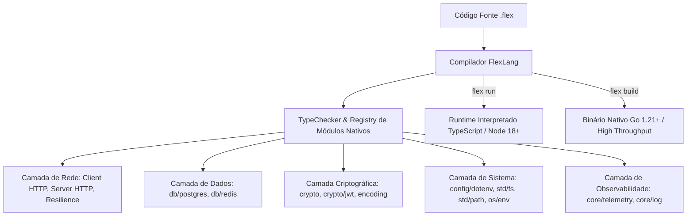

# Visão Geral de Arquitetura — FlexLang v0.4.0 (Distributed Ecosystem)

> **Status:** Draft · **Dono:** Arquitetura de Software e Compiladores · **Última revisão:** agosto/2026
> **Relacionado:** [PRD](prd.md), [Test Plan](test_plan.md), [Release Plan](release_plan.md)

---

## 1. Arquitetura do Compilador e Suporte a Módulos Distribuídos

A **FlexLang v0.4.0** expande o compilador e a biblioteca padrão nativa para atender a **sistemas distribuídos de alta densidade de rede e I/O**:

---

## 2. Padrões de Injeção de Boilerplate no Transpiler Go

Para cada novo módulo da v0.4.0, o `GoTranspiler` (`src/transpiler.ts`) injeta os pacotes correspondentes do ecossistema Go padrão e de bibliotecas de altíssima performance:

| Módulo FlexLang | Pacotes Go Injetados | Papel no Binário Nativo |
|---|---|---|
| `net/http: Client` | `net/http`, `crypto/tls`, `net/url` | Cliente HTTP com pooling nativo e `http.Transport` otimizado |
| `config/dotenv` | `github.com/joho/godotenv` ou parser embutido | Carregamento de `.env` na inicialização |
| `encoding/json` | `encoding/json` | Serialização e deserialização JSON de alta velocidade |
| `encoding/base64` | `encoding/base64` | Codificação Base64 Standard e URL-Safe |
| `encoding/hex` | `encoding/hex` | Codificação e decodificação Hexadecimal |
| `std/fs` | `os`, `io`, `path/filepath` | I/O assíncrono e síncrono no sistema de arquivos |
| `crypto/jwt` | `github.com/golang-jwt/jwt/v5` | Geração e validação de tokens JWT (HS256, RS256) |
| `db/redis` | `github.com/redis/go-redis/v9` | Conexão poolada com Redis e scripts Lua atômicos |
- **`core/resilience`**: Implementado na borda de I/O de rede. O TS usa wrappers async para as promises; o Go usa pacotes como `sony/gobreaker` síncronos na goroutine, unificando a semântica de falha via `Result.Err`.
- **`std/testing`**: Framework unitário. O compilador injeta decorators invisíveis no TS e mapeia para pacotes `testing` no Go, isolando panics e falhas.
- **`std/regex`**: Motor de expressão regular, delegando nativamente ao `RE2` no Go para performance escalável e ao V8 no TS.
- **`core/scheduler`**: Gerenciador assíncrono para rotinas diárias e frequentes (sem interromper o tráfego do HTTP Server no event loop).

---

## 3. Gestão de Memória e Concorrência

1. **Move Semantics com Canais**: Mantém a segurança de threads existente em `Channel.send()`, prevenindo data races.
2. **Coordenação Distribuída**: Em arquiteturas backend enterprise, a concorrência intra-memória é desencorajada (devido às divergências arquiteturais Node Event Loop vs Go Preemptive Threads). Toda proteção atômica e concorrência sobre estado é executada com Mensageria (`mq/events`) e travas distribuídas via **Redis** (`db/redis`), mantendo os processos FlexLang inteiramente stateless e resilientes.
