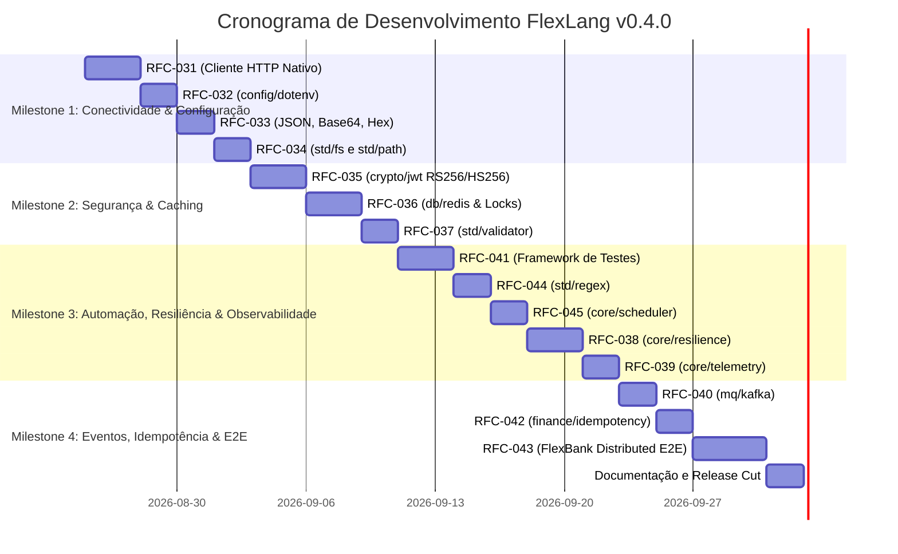

# Plano de Release — FlexLang v0.4.0

> **Status:** Draft · **Dono:** Gerência de Engenharia e Release Management · **Última revisão:** agosto/2026
> **Relacionado:** [PRD](prd.md), [Test Plan](test_plan.md), RFCs 031 a 043 em [`rfcs/`](rfcs/)

---

## 1. Escopo e Versionamento

- **Versão Alvo**: `0.4.0`
- **Pacote npm**: `@flexlang/cli`
- **Tag Git**: `v0.4.0`
- **Foco Temático**: *Enterprise Banking & Distributed Ecosystem*

---

## 2. Milestones de Desenvolvimento

---

## 3. Status das Funcionalidades (RFCs)

| Status | RFC | Funcionalidade |
|---|---|---|
| ✅ | RFC-031 | Cliente HTTP Nativo |
| ⏳ | RFC-032 | Módulo `config` e leitura dotenv |
| ⏳ | RFC-033 | Serialização `std/json` e Encoding |
| ⏳ | RFC-034 | `std/fs` e manipulador de Paths |
| ⏳ | RFC-035 | `crypto/jwt` (RS256/HS256) |
| ⏳ | RFC-036 | Driver nativo Redis e Locks Distribuídos |
| ⏳ | RFC-037 | Motor de validação `std/validator` |
| ⏳ | RFC-038 | Módulo `core/resilience` (Circuit Breaker) |
| ⏳ | RFC-039 | Telemetria `core/telemetry` |
| ⏳ | RFC-040 | Conector `mq/kafka` |
| ⏳ | RFC-041 | Framework de Testes Nativo |
| ⏳ | RFC-042 | Motor de Idempotência `finance/idempotency` |
| ⏳ | RFC-043 | Carga E2E (FlexBank) |
| ⏳ | RFC-044 | Motor de Expressões Regulares (`std/regex`) |
| ⏳ | RFC-045 | Agendador de Tarefas (`core/scheduler`) |

---

## 4. Matriz de Riscos e Mitigações

| Risco Técnico | Probabilidade | Impacto | Mitigação |
|---|---|---|---|
| Incompatibilidade de TLS/mTLS em Go vs Node.js | Média | Alto | Testar com certificados autoassinados de teste gerados via OpenSSL na suíte de CI. |
| Divergência de expiração em JWT | Baixa | Crítico | Utilizar `core/time` UTC como referência de epoch em ambos os runtimes. |
| Saturação de conexões no Cliente HTTP | Baixa | Alto | Configurar pool com limites conservadores padrão e reutilização ativa de keep-alive. |

---

## 5. Definition of Done (DoD)

- [ ] Todas as 13 RFCs (031 a 043) implementadas.
- [ ] 100% dos testes unitários e de integração passando (`npm test`, `npm run test:parity`).
- [ ] Exemplo `examples/10_flexbank_distributed` executando perfeitamente.
- [ ] `CHANGELOG.md` e portal de documentação atualizados.
- [ ] Publicação no npm `@flexlang/cli@0.4.0`.
